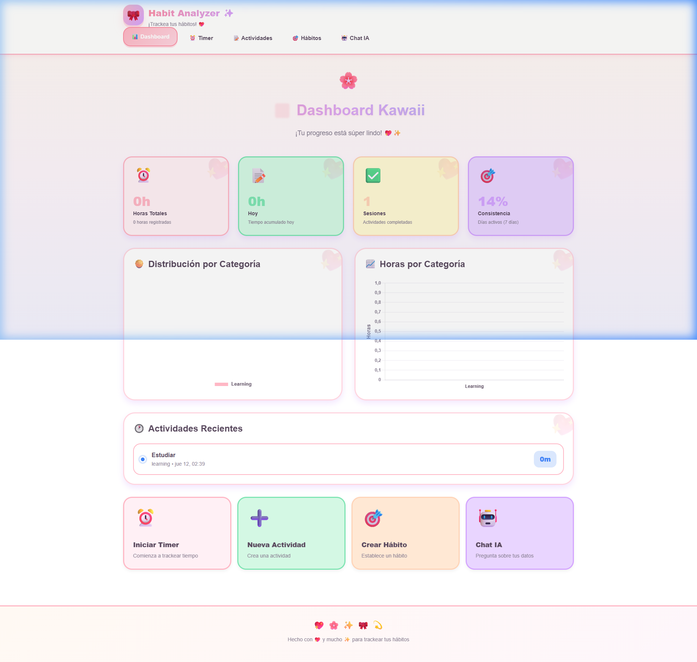
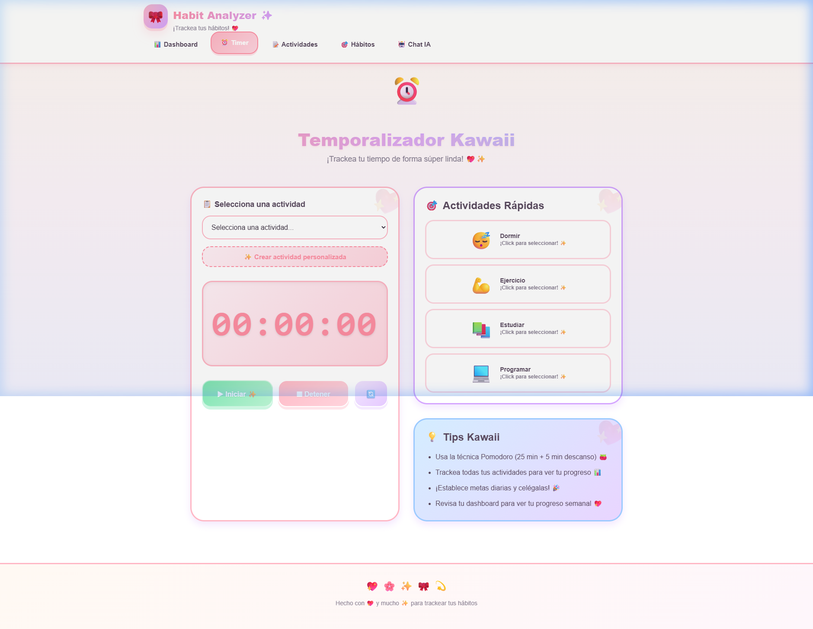
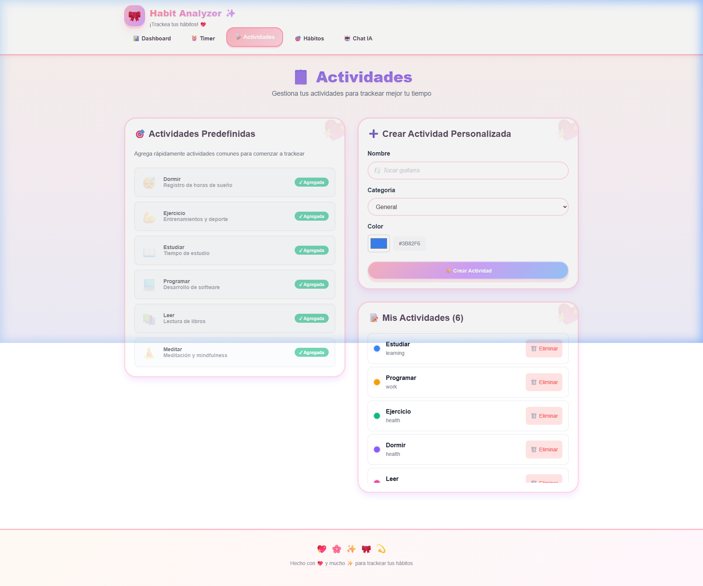
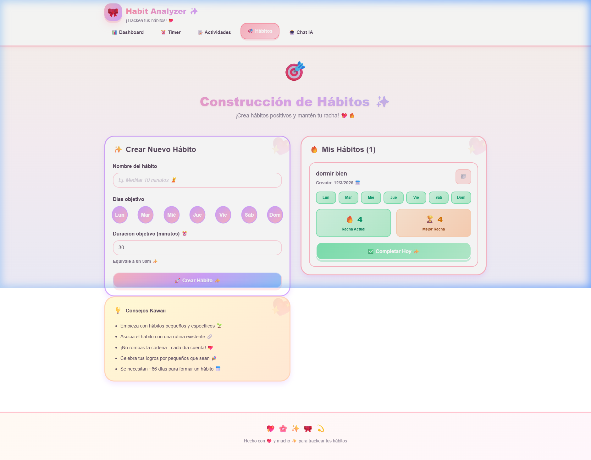
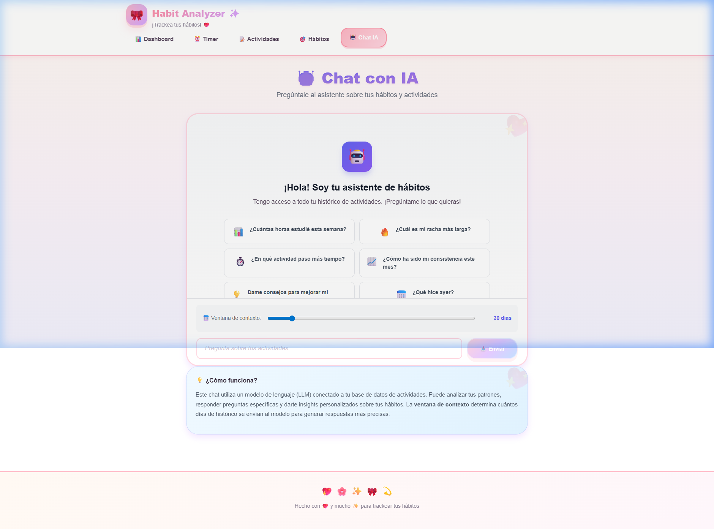

# 🚀 Habit Analyzer & Tracker

<div align="center">
  
</div>

<h3 align="center">
  Tu compañero definitivo para el seguimiento del tiempo, construcción de hábitos y análisis de productividad impulsado por IA.
</h3>

<div align="center">
  
  
  
</div>

---

## 🌟 Características Principales

1. **📊 Dashboard Interactivo**: Visualiza tu progreso diario, tendencias y estadísticas clave al instante.
2. **⏱️ Timer en Tiempo Real**: Cronometra tus actividades con precisión y mantén el enfoque (`Focus Mode`).
3. **📝 Gestión de Actividades**: Registra, categoriza detalladamente y analiza en qué inviertes tu tiempo.
4. **🔥 Seguimiento de Hábitos (Rachas)**: Mantén tus buenas costumbres, visualiza tu consistencia y no rompas la cadena.
5. **🤖 Chat IA Analítico**: Un asistente inteligente incorporado que descubre patrones en tus hábitos y te sugiere optimizaciones en tu rutina diaria.

---

## 📸 Explora la Aplicación

Hemos diseñado una interfaz moderna, limpia y altamente intuitiva. Aquí un vistazo de lo que te espera:

### Tablero Principal (Dashboard)
[](screenshots/dashboard.png)
*Vista panorámica de tu productividad y métricas clave. Un entorno limpio que te da control total a simple vista.*

### Cronómetro y Enfoque (Timer)
[](screenshots/timer.png)
*Mantén el enfoque en lo verdaderamente importante. Registra tiempos exactos en tus tareas con una experiencia de usuario fluida.*

### Historial de Actividades
[](screenshots/actividades.png)
*Un registro organizado y detallado de todo lo logrado durante tu día, categorizado para un análisis profundo.*

### Constructor de Hábitos
[](screenshots/habitos.png)
*Visualiza tus rachas, establece metas diarias y construye la disciplina necesaria para alcanzar tus objetivos a largo plazo.*

### Análisis Inteligente (Chat IA)
[](screenshots/chat-ia.png)
*Deja que la inteligencia artificial te guíe hacia la mejor versión de ti mismo. Chatea con tus propios datos y obtén insights únicos.*

---

## 🛡️ Seguridad y Buenas Prácticas

Este proyecto está configurado para no comprometer nunca información sensible. 
Gracias a nuestra estricta configuración de `.gitignore`, **las variables de entorno (`.env`), bases de datos locales (`*.sqlite`, `*.db`) y credenciales nunca se suben al repositorio**.

Además, el repositorio mantiene un **historial de Git completamente limpio, estructurado y trazable** empleando *Conventional Commits* en español.

---

## 🚀 Empezando (Quickstart)

1. Clona el repositorio:
   ```bash
   git clone https://github.com/axiao1134/Habit-Analyzer.git
   ```
2. Instala las dependencias requeridas en los directorios correspondientes.
3. Copia el archivo de variables de ejemplo para crear tu propio `.env` y añade tus credenciales (p.ej. Keys de IA).
4. Ejecuta los entornos de desarrollo locales:
   ```bash
   npm run dev # en tu directorio de frontend
   ```

Para una guía más técnica de inicio accesible y configuración previa, no dudes en leer [QUICKSTART.md](QUICKSTART.md) y [ACCESSIBILITY.md](ACCESSIBILITY.md).

---
*Construido con ❤️ para ser un referente de innovación UI/UX y arquitectura de software.*
